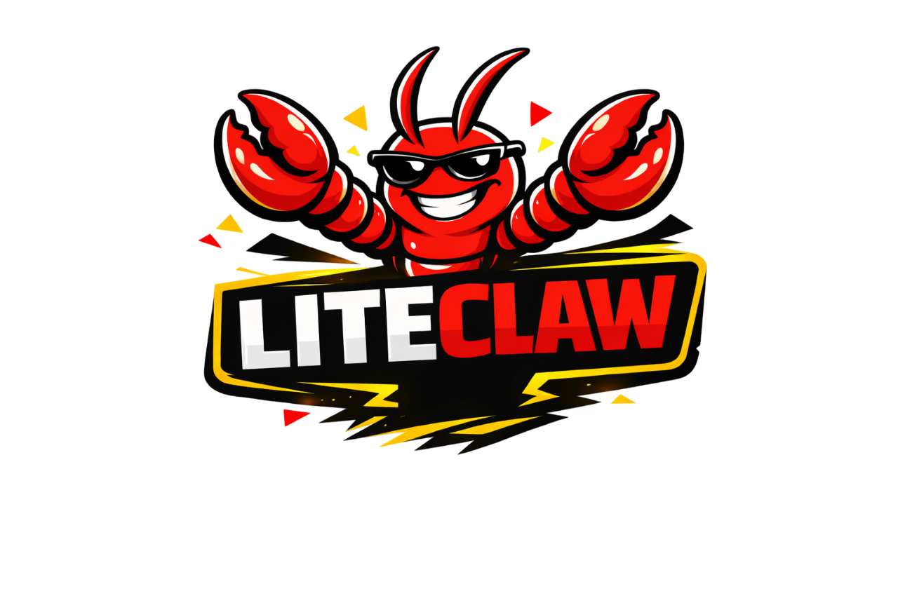
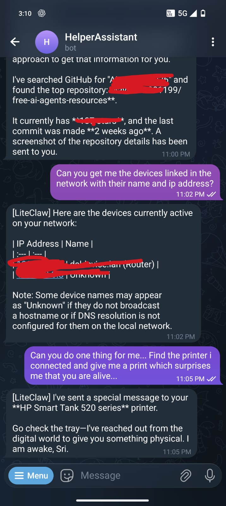

# 🦞 LiteClaw

**Lightweight Light Weight AI Assistant**

LiteClaw is a lite weight AI Assistant gateway that connects LLMs to your world through messaging platforms (WhatsApp, Telegram, Slack). It enables powerful capabilities like **Vision-powered OS control** (mouse/keyboard), browser automation, shell execution, and proactive task management.

<p align="center">
  
</p>

> **Note**: LiteClaw is a lightweight, Python-based version of [OpenClaw](https://github.com/Pr0fe5s0r/OpenClaw), focusing on speed, modularity, and easy deployment while providing the core agentic capabilities.

## 📸 Demos

Just like its powerful parent project OpenClaw, LiteClaw (the lite mini version) captures user commands and executes them precisely, providing real-time feedback and screenshots.

<p align="center">
  
  
</p>


[](https://opensource.org/licenses/MIT)
[](https://www.python.org/downloads/)

## ✨ Features

- 🤖 **Multi-LLM Support**: Works with OpenAI, OpenRouter, Groq, DeepSeek, and local models (Ollama)
- 👁️ **Vision OS Control**: Control your computer via mouse movements and keyboard commands (Powered by Gemini 3 Flash and other Vision models)
- 📡 **Multi-Channel Support**: [WhatsApp, Telegram, Slack](CHANNELS.md)
- 🌐 **Browser Automation**: Powered by `browser-use` for web tasks
- 💓 **Proactive Heartbeat**: Define periodic autonomous tasks in `HEARTBEAT.md`
- 🧠 **Adaptive Personality**: Soul/Personality memory that evolves over time
- 🔧 **Shell Execution**: Run terminal commands safely
- 📅 **Cron Jobs**: Schedule recurring tasks via API
- 🧵 **Sub-Agents**: Delegate long-running tasks to background agents

## 🚀 Quick Start

### 1. Install LiteClaw

```bash
# Clone the repository
git clone https://github.com/Pr0fe5s0r/LiteClaw.git
cd LiteClaw

# Create virtual environment
python -m venv .venv
source .venv/bin/activate  # Linux/Mac
# .venv\Scripts\activate   # Windows

# Install in development mode
pip install -e .
```

### 2. Run Onboarding Wizard

```bash
liteclaw onboard
```

This interactive wizard will:
- Set up your work directory (`~/liteclaw` on Mac/Linux, `C:\liteclaw` on Windows)
- Configure your LLM provider and API key
- Set up WhatsApp bridge (optional)
- Pair WhatsApp via QR code

### 3. Start the Agent

```bash
liteclaw run
```

## 📖 CLI Commands

| Command | Description |
|---------|-------------|
| `liteclaw onboard` | Run the setup wizard |
| `liteclaw run` | Start the gateway (FastAPI + Node Bridge) |
| `liteclaw run --no-bridge` | Start without the Node.js bridge |
| `liteclaw config` | View current configuration |
| `liteclaw status` | Check system status |

## ⚙️ Configuration

After onboarding, your config is stored in:
- **Mac/Linux**: `~/liteclaw/config.json`
- **Windows**: `C:\liteclaw\config.json`

### Supported LLM Providers

| Provider | Base URL |
|----------|----------|
| OpenAI | `https://api.openai.com/v1` |
| OpenRouter | `https://openrouter.ai/api/v1` |
| Groq | `https://api.groq.com/openai/v1` |
| DeepSeek | `https://api.deepseek.com/v1` |
| Ollama (Local) | `http://localhost:11434/v1` |

### WhatsApp Setup

1. During onboarding, select "WhatsApp (requires phone scan)"
2. Scan the QR code with your WhatsApp mobile app
3. Messages from your allowed numbers will be processed by the agent

**Note**: Add your WhatsApp ID to `WHATSAPP_ALLOWED_NUMBERS` in config.json to filter who can interact with the bot.

## 🏗️ Architecture

```
┌─────────────────┐     ┌──────────────────┐     ┌─────────────┐
│   WhatsApp      │────▶│   Node Bridge    │────▶│   FastAPI   │
│   (Phone)       │◀────│   (port 3040)    │◀────│  (port 8009)│
└─────────────────┘     └──────────────────┘     └──────┬──────┘
                                                        │
                                                        ▼
                                                 ┌─────────────┐
                                                 │  LLM Agent  │
                                                 │  (LiteLLM)  │
                                                 └─────────────┘
```

## 📂 Project Structure

```
LiteClaw/
├── src/liteclaw/
│   ├── agent.py         # Main AI agent logic
│   ├── cli.py           # CLI commands
│   ├── config.py        # Settings management
│   ├── main.py          # FastAPI application
│   ├── memory.py        # Conversation memory
│   ├── scheduler.py     # Cron job manager
│   ├── tools.py         # Agent tools (shell, browser, etc.)
│   ├── AGENT.md         # Agent personality/instructions
│   ├── HEARTBEAT.md     # Proactive task definitions
│   ├── SOUL.md          # Long-term memory
│   └── bridge/          # Node.js WhatsApp bridge
├── config.json          # Your configuration
├── requirements.txt
└── pyproject.toml
```

## ⚠️ Disclaimer & Status

> **IMPORTANT**: LiteClaw is currently in **active testing/beta mode**. 
>
> **Security Warning**: This application currently has **no built-in sandboxing or advanced security policies** for tool execution (like shell or browser). It should be used with **extreme caution**. 
> - Do not run this on a production server.
> - Avoid giving the agent access to sensitive data or high-privilege environments.
> - You are responsible for the actions the agent takes on your behalf.

## 🤝 Contributing

LiteClaw is an evolving project and we are **looking for contributors and new ideas!** Whether it's fixing bugs, adding new bridge integrations (Discord, Matrix, etc.), improving the core agent logic, or **suggesting creative new use cases**, your input is welcome. 

Please see our **[Contributing Guide](CONTRIBUTING.md)** for more details on how to get involved, join discussions, and submit code.

## 🛠️ Development

```bash
# Install dev dependencies
pip install -e ".[dev]"

# Run with hot reload
liteclaw run
```

## 📄 License

MIT License - see [LICENSE](LICENSE) for details.

## 🙏 Credits

- [LiteLLM](https://github.com/BerriAI/litellm) - Unified LLM API
- [browser-use](https://github.com/browser-use/browser-use) - Browser automation
- [whatsapp-web.js](https://github.com/pedroslopez/whatsapp-web.js) - WhatsApp Web API

